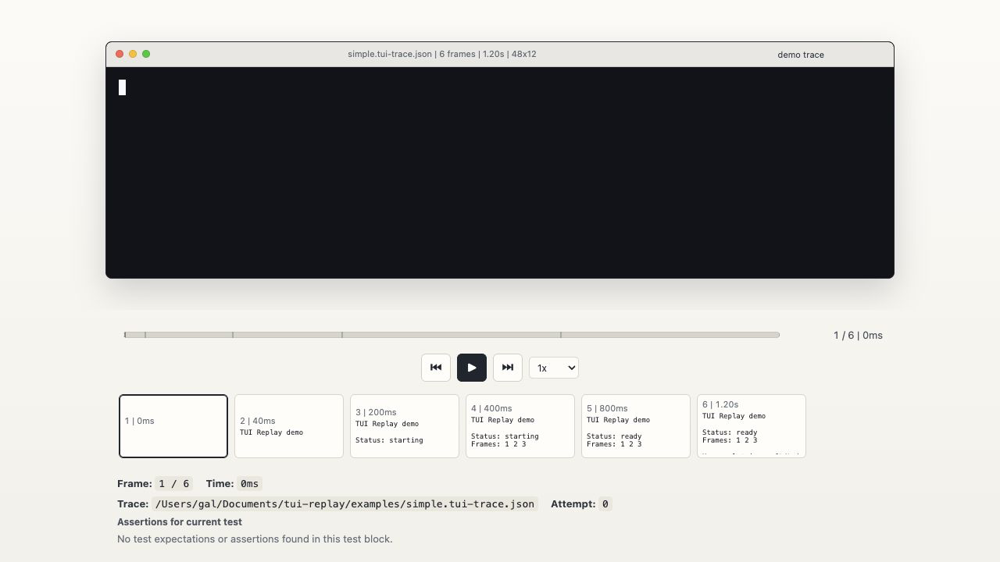
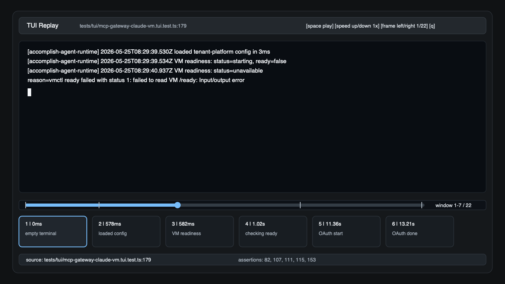

# TUI Replay

View and replay [`@microsoft/tui-test`](https://github.com/microsoft/tui-test) traces from a browser, terminal UI, GIF, or video file.

TUI Replay is a TypeScript CLI package that reads `tui-test` trace files, reconstructs terminal frames with `@xterm/headless`, and exposes the same replay model to a clean web viewer, an OpenTUI-powered terminal viewer, terminal-only GIF exports, and terminal-only video exports. The viewers are read-only: they render what the test emitted, with replay controls, frame previews, timing, source assertions, and optional trace annotations.

## Screenshots

### Web preview



### Terminal UI preview



## Features

- Preview a single `tui-test` trace file or an entire trace directory.
- Replay terminal output with play, pause, previous frame, next frame, and speed controls.
- Show a smooth timeline with frame switch notches and horizontally scrollable frame previews.
- Render frames with terminal cell colors and cursor state through `@xterm/headless`.
- Watch trace files and directories so newly written test traces appear without restarting the server.
- Export animated GIF or MP4/WebM video of the terminal surface only, without the surrounding viewer controls.
- Show source context from the test file, including nearby `assert`, `expect`, and snapshot calls when available.
- Add sidecar annotations for events such as OAuth, user actions, policy decisions, or checkpoints.
- Use one shared data layer for the web UI and the TUI so both viewers load the same traces the same way.

## Install

```bash
npm install
npm run build
```

During local development, run the CLI directly from `dist` after building:

```bash
node dist/cli.js preview examples/simple.tui-trace.json
node dist/cli.js gif examples/simple.tui-trace.json --output simple.gif
node dist/cli.js video examples/simple.tui-trace.json --output simple.mp4
node dist/cli.js tui examples/simple.tui-trace.json
```

After package installation, use the `tui-replay` binary:

```bash
tui-replay preview ./tui-traces
tui-replay gif ./tui-traces/my-test-trace --output my-test.gif
tui-replay video ./tui-traces/my-test-trace --output my-test.mp4
tui-replay tui ./tui-traces
```

## Web Viewer

Start the browser viewer with one or more trace files or directories:

```bash
tui-replay preview .tui-test/cache/tui-traces --project .
```

Useful options:

```bash
tui-replay preview <trace...> \
  --host 127.0.0.1 \
  --port 4390 \
  --project . \
  --no-open \
  --no-watch
```

The `--project` option points at the source tree that produced the traces. TUI Replay uses it to resolve test files from the trace metadata and show related source assertions in the details panel.

The web viewer watches inputs by default. For directories, it detects new trace files. For files, it reloads when the trace or its annotation sidecar changes. `@microsoft/tui-test` writes trace data when the test framework flushes the trace file; TUI Replay updates as soon as that file appears or changes.

## GIF Export

Export an animated GIF of the terminal display itself:

```bash
tui-replay gif .tui-test/cache/tui-traces/my-test-trace --output my-test.gif
```

If the input resolves to multiple traces, use `--trace-index` to choose one:

```bash
tui-replay gif .tui-test/cache/tui-traces --trace-index 3 --output trace-3.gif
```

Useful options:

```bash
tui-replay gif <trace> \
  --output trace.gif \
  --speed 2 \
  --fps 50 \
  --scale 0.75 \
  --font-size 14 \
  --overlay \
  --overlay-position bottom-right \
  --min-delay 20 \
  --last-delay 1000
```

The GIF exporter renders only the terminal grid. It uses the same headless frame reconstruction as the web and TUI viewers, then rasterizes those frames for GIF encoding. Use `--overlay` to add a small metadata layer with `Frame x / y` and the current replay timestamp.

## Video Export

Export MP4 or WebM video of the terminal display:

```bash
tui-replay video .tui-test/cache/tui-traces/my-test-trace --output my-test.mp4
```

The video exporter uses `ffmpeg`, preserving frame timing through a generated frame sequence. Install `ffmpeg` on your PATH, set `TUI_REPLAY_FFMPEG`, or pass `--ffmpeg-path`.

Useful options:

```bash
tui-replay video <trace> \
  --output trace.mp4 \
  --format mp4 \
  --speed 2 \
  --scale 0.75 \
  --overlay \
  --overlay-position bottom-right \
  --ffmpeg-path /opt/homebrew/bin/ffmpeg
```

Use `.webm` output or `--format webm` for WebM:

```bash
tui-replay video .tui-test/cache/tui-traces/my-test-trace --output my-test.webm
```

## Terminal UI

The terminal viewer is powered by OpenTUI core and uses the same `ReplayDataSource` interface as the web server:

```bash
tui-replay tui .tui-test/cache/tui-traces --project .
```

Controls:

| Key | Action |
| --- | --- |
| `Space` | Play or pause |
| `Left` / `Right` | Previous or next frame |
| `Home` / `End` | First or last frame |
| `Up` / `Down` | Increase or decrease playback speed |
| `.` / `,` | Next or previous trace |
| `q` / `Esc` | Quit |

OpenTUI currently works best under Bun. The Node CLI automatically reruns the `tui` command with `bun` when Bun is available.

## Annotation SDK

Annotations are stored next to the trace in a sidecar JSON file named `<trace>.annotations.json`. This keeps upstream trace files untouched while letting tests or helper scripts add domain-specific timeline markers.

```ts
import { appendTraceAnnotation, writeTraceAnnotations } from "tui-replay/sdk";

await writeTraceAnnotations("./.tui-test/cache/tui-traces/oauth-flow", [
  {
    timeMs: 12_400,
    label: "User opened OAuth",
    kind: "oauth",
    description: "The CLI opened the provider authorization URL"
  }
]);

await appendTraceAnnotation("./.tui-test/cache/tui-traces/oauth-flow", {
  frameIndex: 42,
  label: "OAuth callback received",
  kind: "oauth",
  color: "#1f8a70"
});
```

Annotation targets can use `timeMs`, `frameIndex`, or `eventIndex`. During model building, annotations are resolved to the nearest frame and shown on the timeline, thumbnails, and details surface.

Sidecar format:

```json
{
  "version": 1,
  "trace": "./.tui-test/cache/tui-traces/oauth-flow",
  "annotations": [
    {
      "timeMs": 12400,
      "label": "User opened OAuth",
      "kind": "oauth",
      "description": "The CLI opened the provider authorization URL"
    }
  ]
}
```

## Shared Data Layer

Both viewers load traces through the same interface:

```ts
import { createReplayDataSource } from "tui-replay";

const dataSource = createReplayDataSource({
  inputs: ["./.tui-test/cache/tui-traces"],
  projectRoot: process.cwd()
});

const model = await dataSource.load();
```

The returned `PreviewModel` contains trace summaries, rendered frames, resolved annotations, and source details. The browser server serializes this model to the client, while the OpenTUI viewer renders it directly.

You can also export GIFs and videos programmatically:

```ts
import { exportTerminalGif } from "tui-replay/gif";
import { exportTerminalVideo } from "tui-replay/video";

await exportTerminalGif({
  input: "./.tui-test/cache/tui-traces/my-test-trace",
  output: "./my-test.gif",
  speed: 2,
  scale: 0.75,
  overlay: {
    position: "bottom-right"
  }
});

await exportTerminalVideo({
  input: "./.tui-test/cache/tui-traces/my-test-trace",
  output: "./my-test.mp4",
  overlay: true
});
```

## Trace Support

TUI Replay accepts:

- zlib-deflated JSON traces from `@microsoft/tui-test`.
- Raw JSON trace fixtures for development and tests.
- Trace files with or without extensions.
- Directories containing many traces.

Each trace point is replayed through a headless terminal renderer. The viewers display the resulting cell grid instead of running an interactive terminal emulator.

## Development

```bash
npm install
npm test
```

Common commands:

```bash
npm run build
npm run preview -- examples/simple.tui-trace.json --project .
npm run gif -- examples/simple.tui-trace.json --output simple.gif
npm run video -- examples/simple.tui-trace.json --output simple.mp4
npm run tui -- examples/simple.tui-trace.json --project .
```

Project layout:

| Path | Purpose |
| --- | --- |
| `src/cli.ts` | CLI commands for web and TUI preview |
| `src/server` | HTTP server, static HTML, live reload events |
| `src/viewer` | Browser-side replay UI |
| `src/tui` | OpenTUI replay UI |
| `src/gif` | Terminal GIF export |
| `src/video` | Terminal video export |
| `src/media` | Shared terminal media rendering |
| `src/preview` | Shared replay data source and selectors |
| `src/trace` | Trace loading, rendering, annotations, and types |
| `src/source` | Best-effort source expectation extraction |
| `src/sdk.ts` | Annotation SDK |

## License

MIT
